# ☕ Sistem POS & Inventory Terpadu Coffee Shop

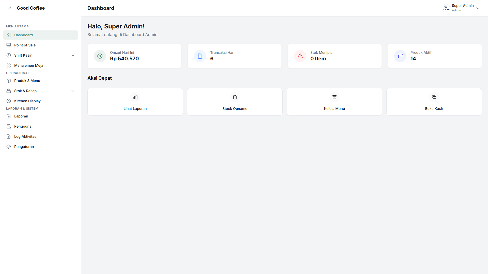

> **Sistem Manajemen Terpadu Point of Sale (POS), Inventori Bahan Baku, Kitchen Display System (KDS), Menu QR Digital, dan Laporan Keuangan khusus Coffee Shop & Resto Skala Outlet Tunggal (Single Outlet).**

---

## 📌 Ringkasan Proyek

**Native Coffee Shop POS** adalah solusi software operasional *end-to-end* yang dirancang untuk menyederhanakan alur kerja kedai kopi. Dibangun menggunakan **PHP Native dengan Arsitektur Custom MVC**, aplikasi ini menawarkan performa yang sangat cepat, ringan, efisien, dan mudah di-deploy tanpa ketergantungan pada heavy-framework pihak ketiga.

Sistem ini memfasilitasi transaksi kasir harian, manajemen shift kas, pemesanan meja secara independen oleh pelanggan via QR Code, alur kerja dapur secara real-time melalui *Kitchen Display System* (KDS), perhitungan HPP (Harga Pokok Penjualan) & pengurangan stok bahan baku otomatis berdasarkan resep, hingga penyusunan laporan akuntansi resmi berformat PDF.

---

## 🖼️ Tangkapan Layar Aplikasi (Screenshots)

Seluruh tangkapan layar antarmuka aplikasi tersimpan secara lengkap di direktori [`/screenshot`](screenshot/):

### 1. Antarmuka Utama & Point of Sale (POS)
| Halaman Login | Point of Sale (POS) Kasir |
|---|---|
| 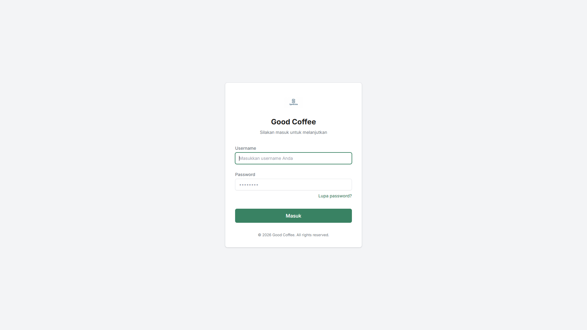 | 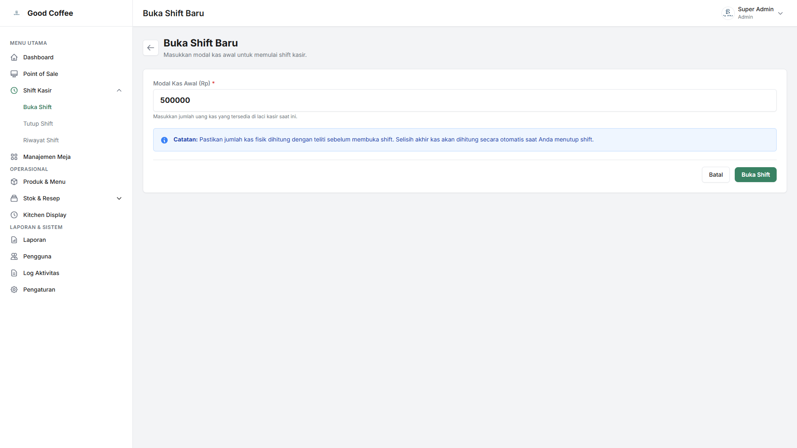 |

| Buka Shift Kasir | Tutup Shift Kasir |
|---|---|
|  |  |

### 2. Pesanan Digital Pelanggan & Layar Dapur (KDS)
| Kitchen Display System (KDS) | Menu Digital Pelanggan (QR Code) |
|---|---|
| 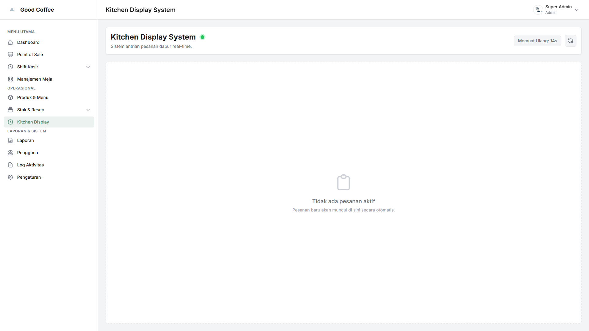 | 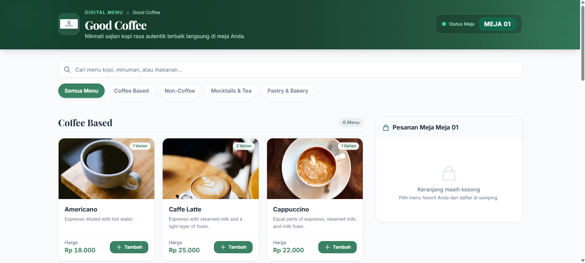 |

### 3. Manajemen Inventori & Resep (HPP)
| Bahan Baku (Inventory) | Kelola Resep Produk (HPP) |
|---|---|
| 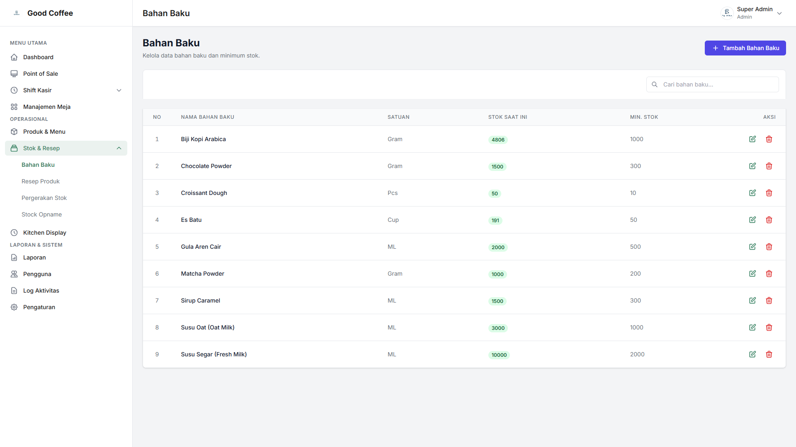 | 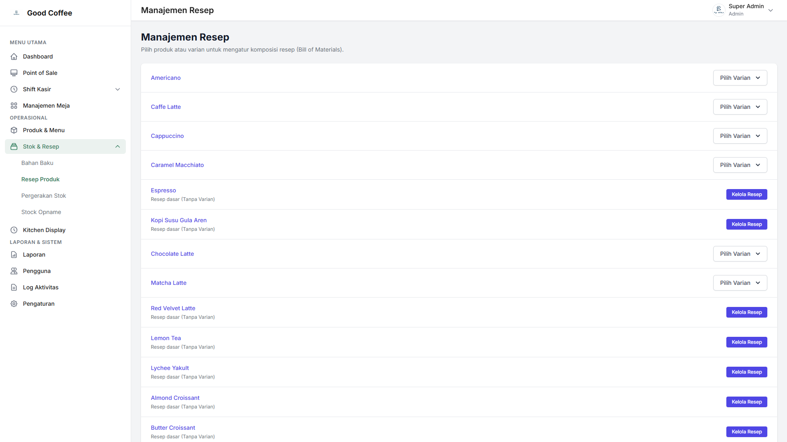 |

| Pergerakan Stok (Log Movement) | Stock Opname Sinkron |
|---|---|
| 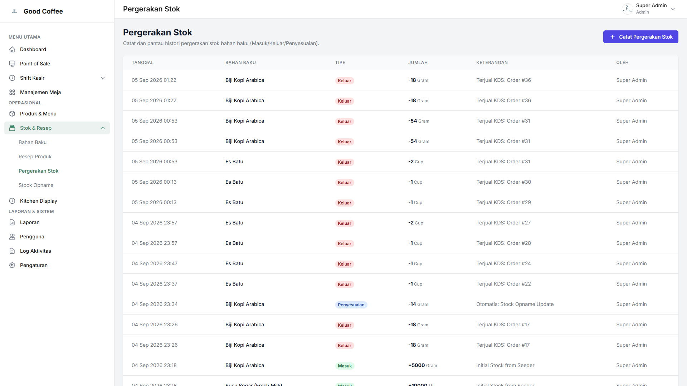 | 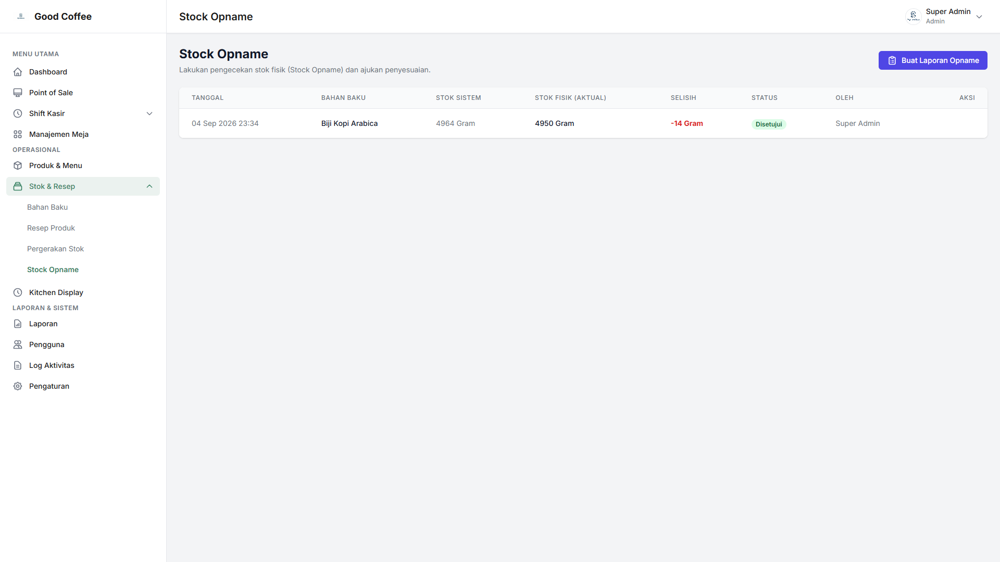 |

### 4. Pelaporan Keuangan & Administrasi
| Laporan Penjualan Harian | Laporan Pergerakan Stok |
|---|---|
| 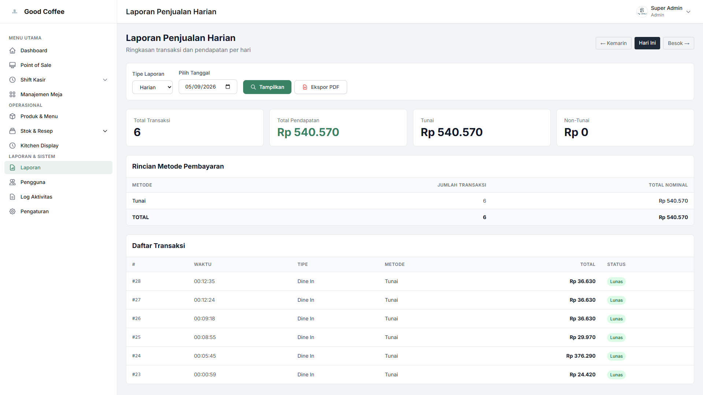 | 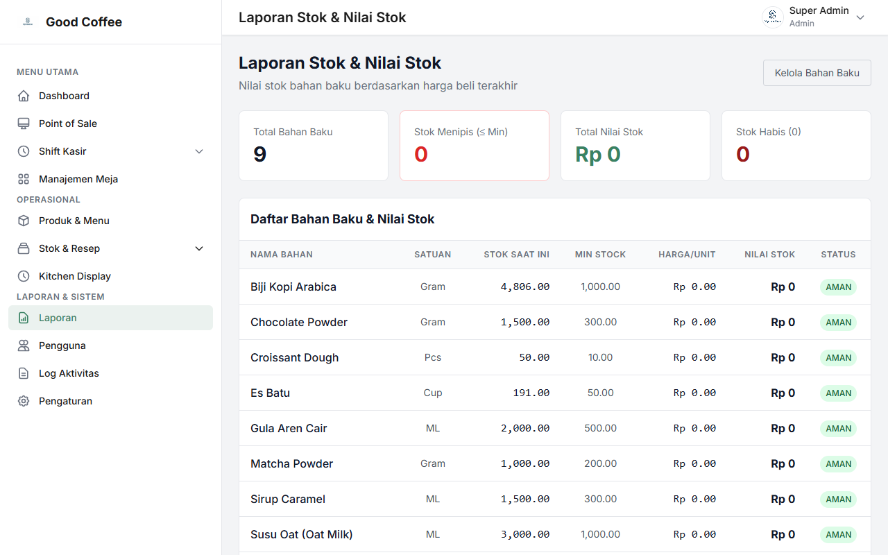 |

| Manajemen Meja & QR | Kelola Produk & Variasi |
|---|---|
| 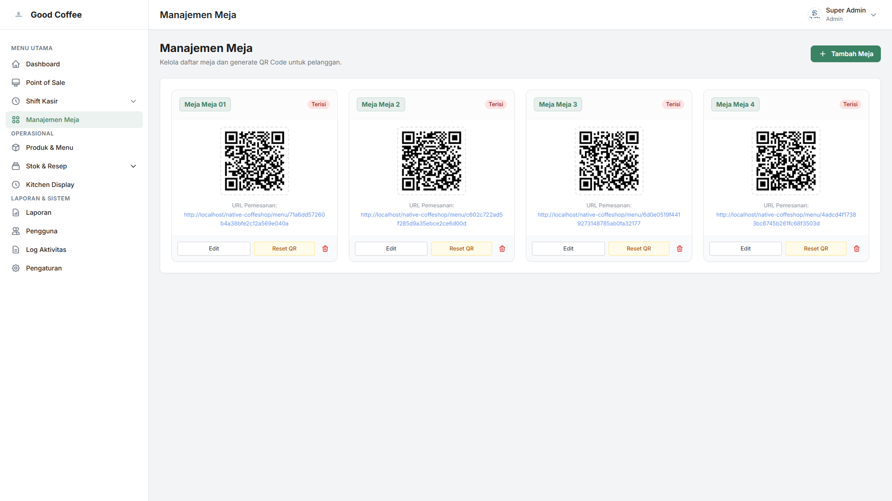 | 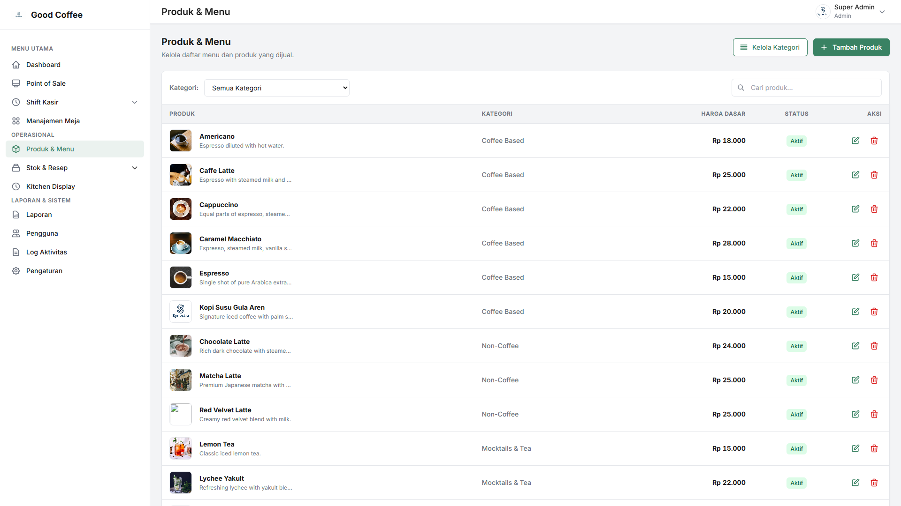 |

> 📂 *Lihat seluruh 22 tangkapan layar lengkap di folder [`/screenshot`](screenshot/).*

---

## 🔥 Fitur-Fitur Utama

1. **Point of Sale (POS) & Manajemen Shift**
   - Transaksi kasir cepat berbasis interaksi AJAX (Alpine.js).
   - Pengelolaan modal awal shift, pencatatan transaksi kasir, dan penutupan shift kas (*cash count reconciliation*).
   - Dukungan cetak struk fisik ke printer thermal 58mm.

2. **Menu QR Code Digital Pelanggan**
   - Tampilan katalog responsif (*Persuade Mode*) berbasis font elegan Playfair Display.
   - Pelanggan dapat memesan langsung dari meja dengan memindai kode QR tanpa perlu mengunduh aplikasi tambahan.

3. **Kitchen Display System (KDS)**
   - Monitor pesanan masuk di area bar/dapur secara real-time.
   - Perubahan status pesanan (*Diproses*, *Selesai*) yang langsung memotong stok bahan baku secara otomatis sesuai resep.

4. **Manajemen Stok, HPP & Resep Dinamis**
   - *Recipe Management*: Hubungkan setiap produk/variasi dengan takaran bahan baku (misal: 1 Caffe Latte = 18g Biji Kopi, 150ml Susu UHT).
   - Perhitungan HPP dinamis untuk mengetahui *margin* keuntungan per produk.
   - *Stock Opname* & Pencatatan Log Pergerakan Stok (Stok Masuk, Stok Keluar, Penyesuaian/Opname, Retur).

5. **Hak Akses Berbasis Peran (RBAC) & Log Aktivitas**
   - 4 Level Akses Pengguna: **Admin**, **Manager**, **Kasir**, dan **Dapur**.
   - Hak akses menu & action yang terproteksi serta pencatatan *Audit Trail / Activity Log* untuk keamanan operasional.

6. **Laporan Keuangan & Ekspor PDF**
   - Laporan Penjualan (Harian, Bulanan, Tahunan) dengan rincian pembayaran tunai & non-tunai (QRIS/Transfer/Debit).
   - Format laporan berstandar akuntansi resmi dengan kolom pengesahan dan fitur ekspor ke dokumen PDF.

---

## 🛠️ Tech Stack & Arsitektur

- **Backend:** PHP Native (versi 7.4 / 8.x) murni tanpa framework eksternal.
- **Arsitektur:** Custom MVC (Model-View-Controller) dengan *Core Router*, *Base Controller*, dan *PDO Database Wrapper*.
- **Database:** MySQL / MariaDB (Prepared Statements via PDO untuk keamanan SQL Injection).
- **Frontend & UI:** HTML5, Tailwind CSS (via CDN), Alpine.js untuk state reaktif interaktif.
- **Typography & Iconography:** Google Fonts (Inter untuk dashboard utilitarian & Playfair Display untuk menu pelanggan), Heroicons.

### Struktur Folder
- `app/Controllers/`: Logika alur aplikasi & pemrosesan request.
- `app/Models/`: Abstraksi data & kueri database (PDO).
- `app/Views/`: Template antarmuka (`components/`, `layouts/`, `pages/`).
- `app/Core/`: Core engine framework custom (Router, Session, Database, Base Controller).
- `public/`: Entry point utama aplikasi (`index.php`, asset statis).
- `config/`: Konfigurasi database & URL sistem.

---

## 🚀 Panduan Instalasi (Development)

1. **Persyaratan Sistem:**
   - PHP minimal versi 7.4 atau 8.x.
   - Web Server (Apache / Nginx / Laragon / XAMPP).
   - Database MySQL / MariaDB.

2. **Langkah-langkah Instalasi:**
   ```bash
   # 1. Clone repository
   git clone https://github.com/synectra-jasa-digital/native-coffeshop.git
   cd native-coffeshop
   ```
3. **Konfigurasi Database:**
   - Buka file `config/config.php`
   - Sesuaikan konfigurasi koneksi database:
     ```php
     define('DB_HOST', 'localhost');
     define('DB_USER', 'root');
     define('DB_PASS', '');
     define('DB_NAME', 'pos_coffeeshop');
     define('BASE_URL', 'http://localhost/native-coffeshop/public');
     ```
4. **Inisialisasi Database:**
   - Buat database `pos_coffeeshop` di MySQL.
   - Jalankan installer via terminal:
     ```bash
     php database/install.php
     ```
   - *Atau* import file SQL manual dari `database/schema.sql`.
5. **Jalankan Aplikasi:**
   - Buka browser dan akses `http://localhost/native-coffeshop/public`.

---

## 💼 Penjualan, Lisensi & Custom Development

Aplikasi ini bersifat **Open for Commercial Purchase, White-Label & Custom Modification**.

Anda diperbolehkan untuk:
- 🛒 **Membeli Source Code Murni:** Mendapatkan hak penuh source code untuk digunakan pada bisnis kedai kopi/resto Anda sendiri maupun klien Anda.
- 🎨 **White-Labeling & Rebranding:** Mengubah logo, nama merek, tema warna, dan identitas visual sesuai brand usaha Anda.
- ⚙️ **Kustomisasi & Pengembangan Fitur:** Memodifikasi kode program, menambah modul pembayaran (payment gateway), integrasi WhatsApp notification, atau fitur kustom lainnya.

---

## 📄 Lisensi & Hak Cipta (License)

Copyright © 2026 **Synectra Jasa Digital**. All Rights Reserved.

Penggunaan, distribusi, komersialisasi, dan modifikasi kode program ini diatur di bawah lisensi resmi dari **Synectra Jasa Digital**. Untuk informasi pembelian lisensi komersial, kerjasama proyek, atau permintaan fitur custom, silakan hubungi tim kami:

- **Organisasi:** Synectra Jasa Digital
- **Repository:** [github.com/synectra-jasa-digital/native-coffeshop](https://github.com/synectra-jasa-digital/native-coffeshop)
- **Layanan:** Jasa Pembuatan & Pengembangan Software Custom, Web & Mobile Application.

---

*Dikembangkan dengan penuh dedikasi oleh **Synectra Jasa Digital**.*
